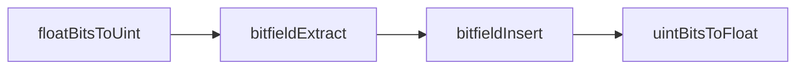
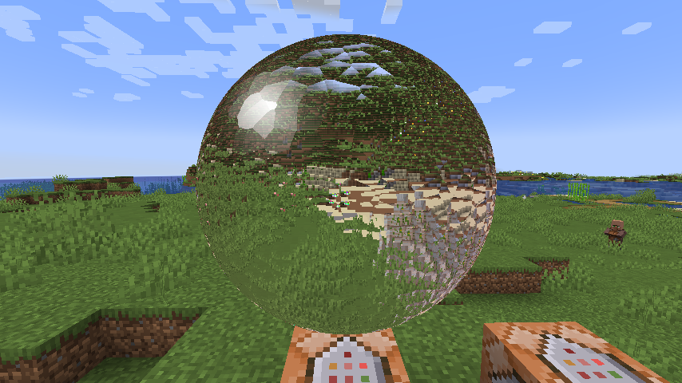

# sphere-rendering

This repository attempts to render sphere in Minecraft 1.20.6.

## Forward pass value

How to forward pass values without losing precision is the key to this repository. Here is my solution. Requires glsl version 400 or higher.

## Gallery

